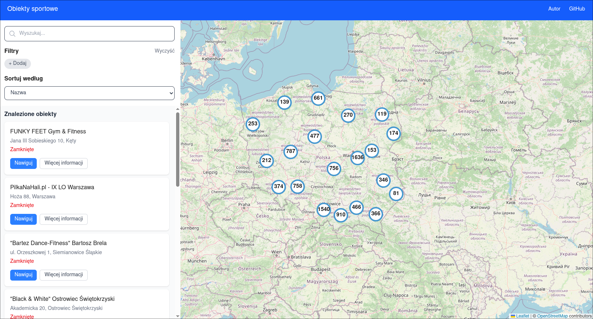
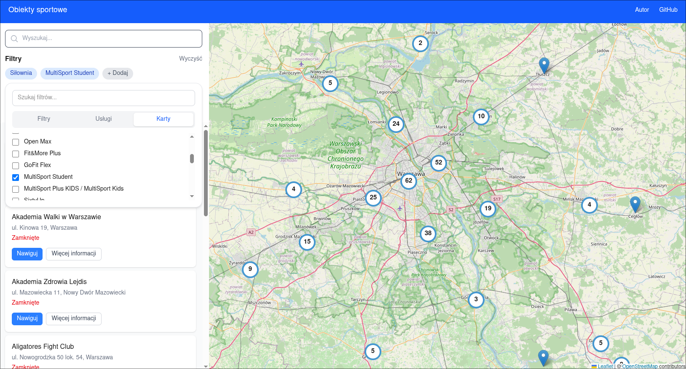
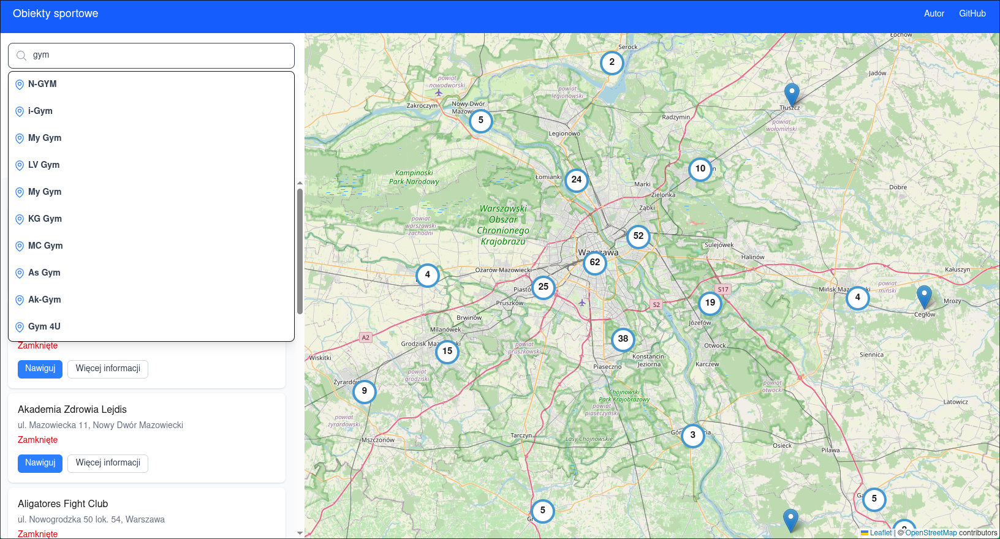
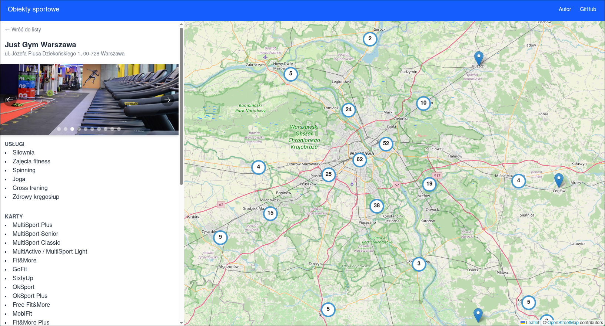

# Sports facilities map

An interactive web application that aggregates data about sports facilities from multiple sources. It displays the facilities on a user-friendly map and supports search and filtering features.

## Usage
Check out [client's](client/README.md) and [server's](server/README.md) README files.

## Live version
Check out [the live version](https://obiekty-sportowe.netlify.app/). It might take a minute before the website starts fully working on first load as the API is hosted on a free service.

## Technologies used
### Server
- PostgreSQL (with PostGIS for spatial queries and pg_trgm for fuzzy text search), TypeORM for querying from Nest
- NestJS for handling the API
- Jest for testing

### Client
- NextJS - framework for React
- leaflet, react-leaflet for handling OpenStreetMap API
- Tailwind for styling + Heroicons
- Jest for testing

## Future ideas
- Adding facilities to favourites list, user comments and ratings
- Searching for people that want to play sports at a given sports facility/nearby
- Add more data providers
- Write documentation and tests
- Optimize for mobile devices
- Localization

## Screenshots

## Contributing
Contributions are welcome. If you'd like to help, please open an issue or pull request.

## License
This project uses the [MIT](LICENSE) license.